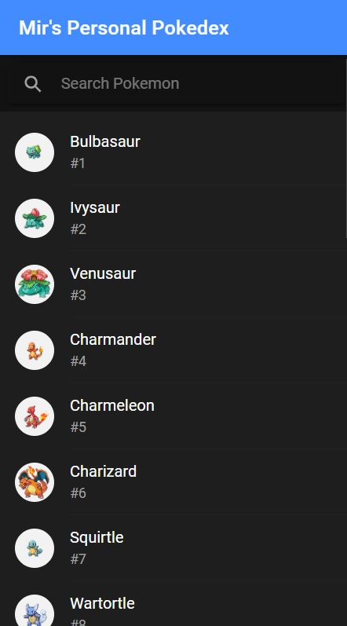
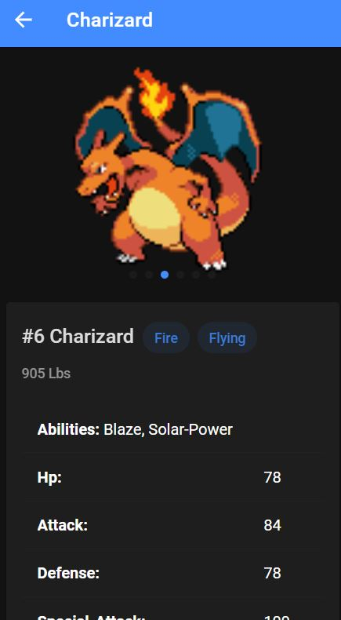
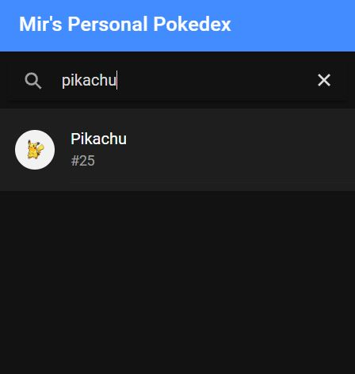

 **A Pokedex built in Ionic + Angular**

```bash
cd pokedex
npm i
ionic serve
```

### Home


### Pokemon Details


### Search


What I learnt
- [x] API Calls for PokeAPI in Angular+Ionic
- [x] Routing
- [x] Infinite Scrolling using offsets
- [x] Search

________

Will attach the YouTube video I learnt this from as I find it!
